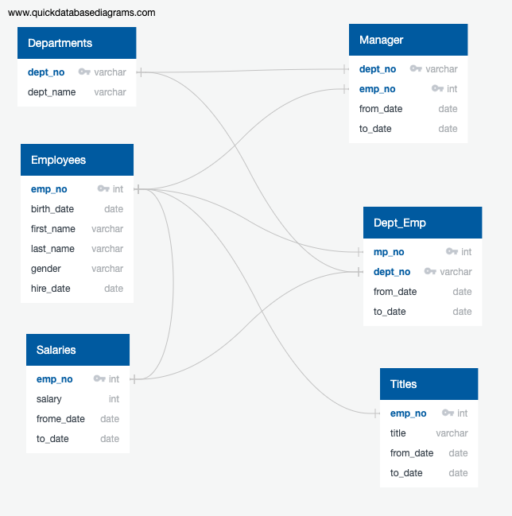

# Pewlett-Hackard-Analysis

## Overview of the analysis: 
In the project of Pewlett-Hackard-Analysis, it need to organized and analysis how many people properly turn to retire over on next few years.
Sincerly, we use the PostgreSQL to create the connection with each database.That is relational database and using SQL to better understand the relative on data.
Create a conceptual diagram to have clear idea what is the primary key and foreign key sign with which group of data.

## Results: 
There having 90,398 people who is senior born from 1952 to 1955 eligible to retired in next few years.There have 29,414 who are title on Senior Engineer is 32% of who are eligible for retirement.
And it will have 31% (28,254 employees) who are Senior staff in below picture.
Those people are qualify for the retirement.

## Summary: 
Take a look with picture below. The company have total mentorship eligibility on 1549. And according to the total mentorship eligibility, senior staff who close to retirement is the largest group at this moment. 
It has 569 emloyees will be plan on the retired. Base on the data anlysis, the company Pewlett Hackard need to hire many new generation employees will be give a support after someone retired.
In the meantime, senior employees also can train with the new hirer. 

